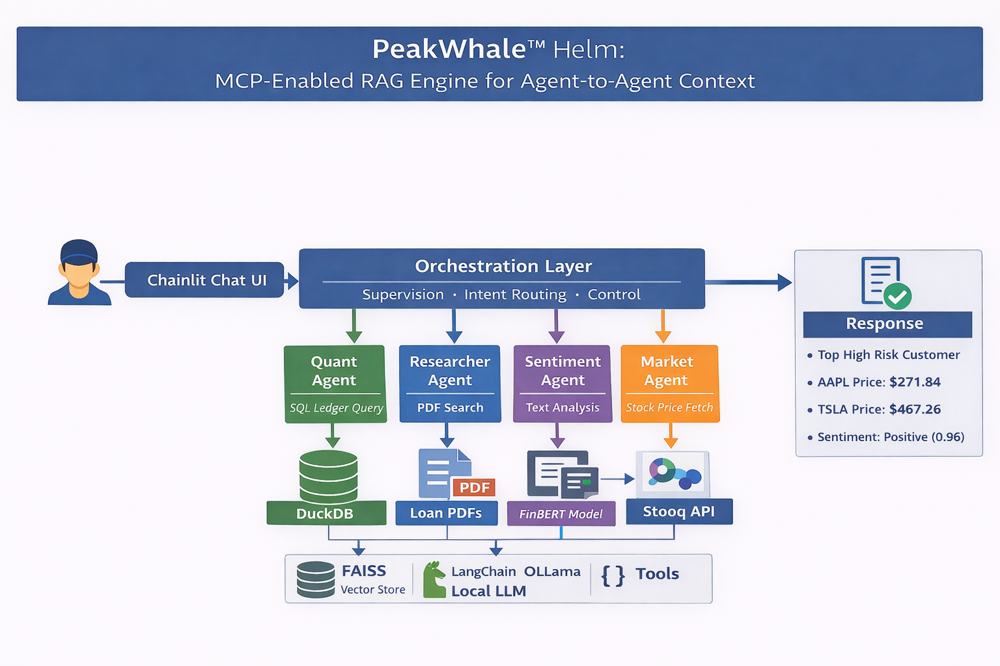

# ⚓ PeakWhale™ Helm

### Multi Agent Financial Intelligence System, Local, Open Source, Demo First

PeakWhale™ Helm is a local first, multi agent AI system that demonstrates how modern agentic architectures can analyze structured financial data and unstructured documents together, in a clean, explainable, enterprise style workflow.

This project is part of the PeakWhale™ open source ecosystem, built to showcase real world AI architecture patterns for recruiters, engineers, and practitioners.

## Important Notice

All data in this repository is 100 percent synthetic.
Customer names, transaction values, merchants, documents, and PDF which stands for Portable Document Format files are randomly generated, and used for demonstration purposes only.

---

## System Architecture

Make sure this file exists and is committed exactly here

`docs/architecture.png`



---

## Enterprise Business Problem

In real enterprises, financial insights are fragmented across systems.

* Transaction activity lives in data warehouses, ledgers, and operational databases.
* Supporting evidence lives in documents, such as loan applications, statements, and case notes.
* Analysts and investigators spend significant time, manually connecting structured records to unstructured evidence, to answer basic questions.

This creates consistent pain points in fraud, compliance, risk, underwriting, and audit workflows.

* Slow time to insight, because humans have to pivot between tools.
* Higher operational cost, because triage and investigation work does not scale easily.
* Lower explainability, because insights are often not tied back to specific evidence in a repeatable way.

PeakWhale™ Helm demonstrates an enterprise style solution pattern, where specialized agents collaborate, use deterministic tools, and produce grounded answers that are traceable to both the database and the source documents.

---

## What PeakWhale™ Helm Does

Peakwhale™ Helm lets a user ask multi step questions, for example

```text
Find the customer with the most Gambling High Risk transactions and check their loan application for income source.
```

Behind the scenes, multiple agents collaborate to

1. Query a financial ledger using SQL, which stands for Structured Query Language.
2. Search loan application PDFs using embeddings and vector search.
3. Merge results into a single grounded answer, backed by evidence.
4. Explain how the answer was derived, using tool traces.

All locally, without cloud APIs.

---

## Architecture Overview

| Component                                                    | Responsibility                                                         |
| ------------------------------------------------------------ | ---------------------------------------------------------------------- |
| Chainlit UI                                                  | Interactive chat interface and step logging                            |
| Supervisor Agent                                             | Routes intent, orchestrates agents, and manages multi step tasks       |
| Quant Agent                                                  | Executes SQL queries on DuckDB for structured analysis                 |
| Researcher Agent                                             | Searches loan PDFs via semantic search, then extracts relevant lines   |
| Extractor                                                    | Normalizes facts into shared state for consistent downstream reasoning |
| DuckDB                                                       | Local analytical database for transactions and customer records        |
| PDF Vault                                                    | Synthetic loan applications stored as PDFs                             |
| FAISS, which stands for Facebook AI Similarity Search        | Vector index for document retrieval                                    |
| Local LLM, which stands for Large Language Model, via Ollama | Reasoning and response generation                                      |

---

## Example End to End Flow

### User prompt

```text
Find the customer with the most Gambling High Risk transactions and check their loan application for income source.
```

### Agent execution flow

1. Supervisor detects a multi step request and decomposes it into subtasks.
2. Quant Agent queries DuckDB to identify the top risk customer.
3. Researcher Agent searches PDFs for that customer, then extracts the requested field.
4. Extractor merges structured and unstructured results into shared state.
5. The local LLM generates a clear, grounded response, aligned to the retrieved evidence.

### Example final answer

```text
Customer ID: 2631d00b
High Risk transactions: 8
Income source: Freelance Consulting
```

---

## Technology Stack

* Python 3.11
* DuckDB, local analytical database
* Chainlit, agent UI and logging
* LangGraph style orchestration
* FAISS, which stands for Facebook AI Similarity Search, for vector search
* SentenceTransformers MiniLM for embeddings
* Ollama for local LLM runtime
* uv for Python environment management

---

## Repository Structure

```text
peakwhale-helm/
  app.py
  main.py
  src/
    graph.py
    tools.py
    seed_data.py
    generate_docs.py
  scripts/
    demo_reset.py
  data/
    ledger.duckdb
    vault/
  docs/
    architecture.png
  README.md
  LICENSE
  pyproject.toml
```

---

## Quick Start

### Prerequisites

* Python 3.11 or newer
* Ollama installed and running
* DuckDB installed
* uv installed

### Install dependencies

```bash
uv sync
```

### Reset demo data

Using Make

```bash
make demo
```

Or run the script directly

```bash
uv run python scripts/demo_reset.py
```

This deletes old demo data and regenerates

* Synthetic ledger in DuckDB
* Synthetic loan application PDFs

### Run the application

```bash
uv run chainlit run app.py -w
```

Open

```text
http://localhost:8000
```

---

## Viewing Data Manually

### DuckDB CLI, which stands for Command Line Interface

```bash
duckdb data/ledger.duckdb
```

Then run

```sql
SHOW TABLES;
SELECT * FROM customers LIMIT 10;
SELECT * FROM transactions LIMIT 10;
SELECT * FROM transactions WHERE category = 'Gambling/High Risk' LIMIT 25;
```

### PDFs

Open this folder in Finder

```text
data/vault/
```

Then double click any PDF.

---

## Why This Project Exists

PeakWhale™ Helm demonstrates enterprise grade patterns, in a compact, interview ready repo.

* Agent to agent coordination, with clear separation of responsibilities.
* Deterministic tool usage, where databases and documents are the source of truth.
* Grounded answers, tied to specific records and extracted document lines.
* Local first architecture, which is useful for privacy, offline demos, and rapid iteration.
* Observability, via step logging and tool traces, to make reasoning auditable.

---

## Part of the PeakWhale™ Ecosystem

* PeakWhale™ Orca, real time fraud detection
* PeakWhale™ Harbor, real estate valuation
* PeakWhale™ Sonar, automated threat detection
* PeakWhale™ Delta, decision support systems

---

## License

MIT License
© 2025 PeakWhale™

---

## Author

Built by Addy
AI systems, agentic architectures, enterprise machine learning
